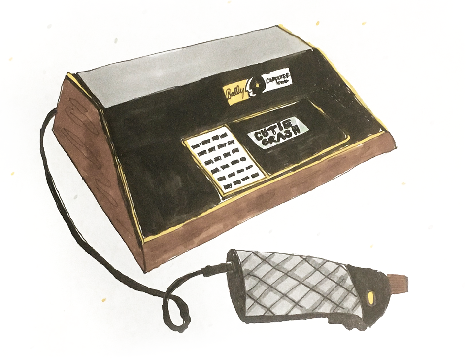
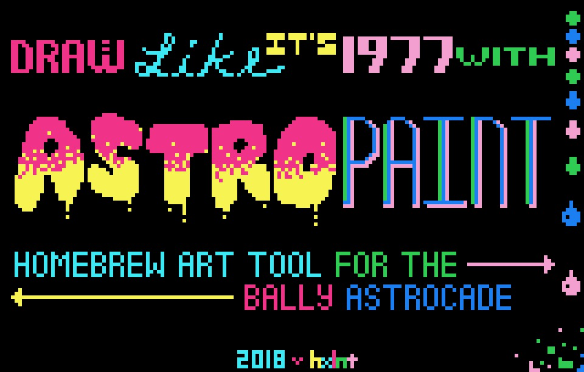

# 🌠 ASTROCADE DEV 🌠

Hello! Let's make cute software for the Bally Astrocade!

## Introduction
The Bally Astrocade is a slightly obscure 8-bit home computer released in the late 1970s. The Astrocade boasts impressive (for its day) specs: a 1.7MHz Z80 8-bit CPU, 4KB RAM, 256 available colors, 3 square-wave audio channels, and 4 controller ports. This repo contains my Astrocade homebrew demos as well as tools for making Astrocade development easier and more fun. 

## Table of contents
- [Demos](#demos)
- [Tools](#tools)
- [External resources](#external-resources)

## Demos
The `demos` folder contains my latest Astrocade demos. Compiling them from source requires `HVGLIB.H` and the Zmac assembler. (See [External resources](#external-resources).)
 - `01-helloworlds` is baby's first Astrocade homebrew, simply displaying text that reads, "HELLO, WORLDS!"
 - `02-telephone` is an audio demo of a telephone ringing that also features background graphics.
 - `03-horcbpal` dynamically changes the *hor*izontal *c*olor *b*oundary (HORCB) based on the position of the player 1 controller knob.

I'll continue to add more demos as often as I can.

## Tools
The `tools` folder contains some development tools I've created; feel free to use them as well!
 - Astroimg is a Python command-line tool that converts images to Z80 assembly. It automatically handles resizing and color downsampling. Usage: `python astroimg.py path/to/img.png [option: --dither]`. For more information, check [the Astroimg README](https://github.com/hxlnt/astrocade/tree/master/tools/astroimg).

 
 - Astropaint is a browser-based tool I created for drawing original Astrocade background graphics. It's probably easiest to just use it online [here](https://rawgit.com/hxlnt/astrocade/master/tools/astropaint/index.html). You'll be able to draw a screen like this one, which conforms to the graphic limitations of the Astrocade, then export the drawing as Z80 assembly. There are some optimizations that would make this run much faster, so if you're the fixin' type, I'll happily review your pull request!
 
 
 - Compiling and launching your code requires several sequential command-line processes. It's only four or five lines, but you won't want to type them again and again--and risk making errors--every time you want to test a new bit of code. So, I wrote this [compileAndLaunch.bat script](https://github.com/hxlnt/astrocade-dev/blob/master/tools/compileAndLaunch.bat). To assemble your code and launch the resulting ROM in MAME, simply place the script alongside your source code, edit a line in the script to point to your MAME installation, save the script, then run `compileAndLaunch.bat mycode` where `mycode` is the name of your .asm file **without the file extension.**

## External resources

To make games and software for the Bally Astrocade, you'll want a few additional tools and resources listed below.

1. **Astrocade helper library** [HVGLIB.H](http://www.ballyalley.com/ml/ml_tools/HVGLIB.zip) is a Bally Astrocade library used in most tutorials and sample code. You'll typically include it at the top of your source code files by typing `INCLUDE HVGLIB.H` at the very top of your code.

2. **Code editor** Choose your favorite IDE with Z80 syntax highlighting. I use [VS Code](http://code.visualstudio.com) for Windows/Mac/Linux, which also has a built-in terminal pane for running your compilation and testing scripts.

3. **Assembler** The Zmac assembler for [Windows](http://www.ballyalley.com/ml/ml_tools/Zmac13_win32.zip) or [Linux](http://www.ballyalley.com/ml/ml_tools/zmac-linux.zip). There are different versions of this assembler floating around online, but this particular version is the one used for many tutorials and source code samples, including my own. If you choose a different Z80 assembler, then macros, input rules, and other assembler-specific features may differ and code examples will need to be modified accordingly.

4. **Emulator** Once your code is successfully assembled into a binary file, you can test it in the Astrocade emulator inside [MAME](https://github.com/mamedev/mame/releases).

[Bally Alley](http://www.ballyalley.com/) is the definitive source for Bally Astrocade development. There, you'll find source code samples, tutorials, tools, manual scans, even an Astrocade-themed podcast! Much of what I make and post here will likely borrow heavily from Bally Alley's wealth of information. It's an excellent resource!
