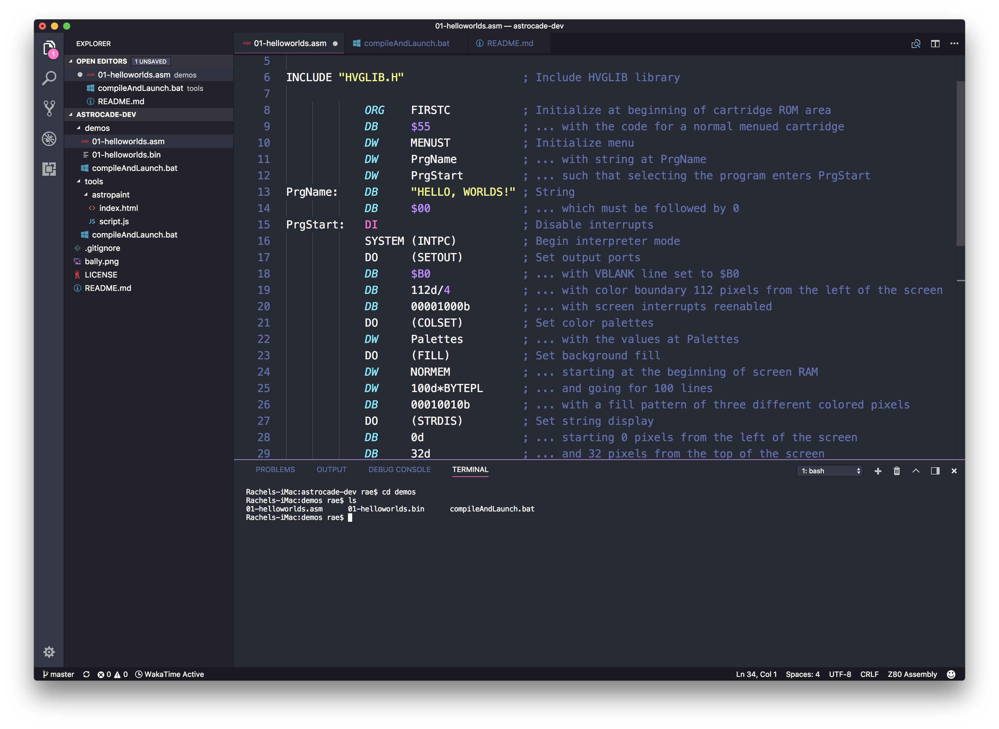

# 🍄 ASTROCADE DEV 🍄

Hello! Let's make cute software for the Bally Astrocade!

## Introduction
I'm teaching myself how to develop for the slightly-obscure Bally Astrocade, an 8-bit home computer/game console released in the late 1970s. The Astrocade boasts impressive (for its day) specs: a 1.7MHz Z80 8-bit CPU, 4KB RAM, 256 available colors, 3 square-wave audio channels, and 4 controller ports. If you want to learn alongside me, this repo will contain the demos I create as well as any tools I create to make my workflow easier and more fun. 

## Table of contents
- [Examples](#examples)
- [Development tools](#development-tools)
- [Additional learning resources](#additional-learning-resources)

## Examples
- The `demos` folder contains my Astrocade experiments (highly-commented source code and binaries). Compiling demos from source requires `HVGLIB.H` and the Zmac assembler. (See [Development tools](#development-tools) for more information.)
    - `01-helloworlds` is baby's first Astrocade homebrew, simply displaying text that reads, "HELLO, WORLDS!"
    - `02-telephone` is an audio demo of a telephone ringing that also features background graphics.
    - `03-horcbpal` demonstrates interactive updating of the *hor*izontal *c*olor *b*oundary (HORCB) by turning the player 1 controller knob.

## Development tools

To make games and software for the Bally Astrocade, grab the tools listed below.

  1. **Astrocade helper library** [HVGLIB.H](http://www.ballyalley.com/ml/ml_tools/HVGLIB.zip) is a Bally Astrocade library used in most tutorials and sample code. You'll typically include it at the top of your source code files by typing `INCLUDE HVGLIB.H` at the very top of your code.

2. **Code editor** Choose your favorite IDE with Z80 syntax highlighting. I use [VS Code](http://code.visualstudio.com) for Windows, Mac, or Linux, which also has a built-in terminal pane for running your compilation and testing scripts. I use the [Z80 Assembly](https://marketplace.visualstudio.com/items?itemName=Imanolea.z80-asm#overview) syntax extension and the [Dracula color theme](https://marketplace.visualstudio.com/items?itemName=dracula-theme.theme-dracula).

  

3. **Assembler** The Zmac assembler for [Windows](http://www.ballyalley.com/ml/ml_tools/Zmac13_win32.zip) or [Linux](http://www.ballyalley.com/ml/ml_tools/zmac-linux.zip). There are different versions of this assembler floating around online, but this particular version is the one used for many tutorials and source code samples, including my own. If you choose a different Z80 assembler, macros, input rules, and other assembler-specific features may differ and code examples will need to be modified accordingly.

4. **Emulator** Once your code is successfully assembled into a binary file, you can test it in the Astrocade emulator inside [MAME](https://github.com/mamedev/mame/releases).

5. **Optional: Build script** Compiling and launching your code requires several sequential command-line processes. It's only four or five lines, but you won't want to type them again and again--and risk making errors--every time you want to test a new bit of code. So, I wrote this [compileAndLaunch.bat script](https://github.com/hxlnt/astrocade-dev/blob/master/tools/compileAndLaunch.bat), which you can find in the `tools` folder in this repo. To assemble your code and launch the resulting ROM in MAME, simply place the script alongside your source code, edit a line in the script to point to your MAME installation, save the script, then run `compileAndLaunch.bat mycode` where `mycode` is the name of your .asm file **without the file extension.**

6. **Optional: Graphics editor** The `tools` folder contains source code for Astropaint, a browser-based tool I created for drawing Astrocade background graphics. It's probably easiest to just use it online [here](https://rawgit.com/hxlnt/astrocade/master/tools/astropaint/index.html). You'll be able to draw a screen like this one, which conforms to the graphic limitations of the Astrocade, then export the drawing as Z80 assembly. I know there are still some bugs that I haven't gotten around to fixing; if you're the fixin' type, I'll happily review your pull request!

  

## Additional learning resources
[Bally Alley](http://www.ballyalley.com/) is the definitive source for Bally Astrocade development. There, you'll find source code samples, tutorials, tools, manual scans, even an Astrocade-themed podcast! Much of what I make and post here will likely borrow heavily from Bally Alley's wealth of information. It's an excellent resource!
